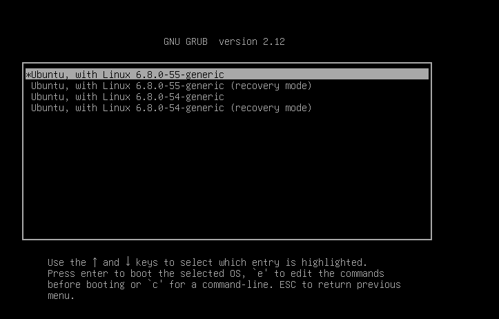

# Linux System Maintenance

### Basic Command

To check the operating system of the machine 

```bash
server@ubuntuserver:~$ hostnamectl
 Static hostname: ubuntuserver
       Icon name: computer-vm
         Chassis: vm 🖴
      Machine ID: 5ce896d58fab45bfa9ba330a1d2c3350
         Boot ID: 68f56c6633d1444bb33ea32403b40fbc
  Virtualization: vmware
Operating System: Ubuntu 24.04.1 LTS
          Kernel: Linux 6.8.0-55-generic
    Architecture: x86-64
 Hardware Vendor: VMware, Inc.
  Hardware Model: VMware Virtual Platform
Firmware Version: 6.00
   Firmware Date: Thu 2020-11-12
    Firmware Age: 4y 4month 1w
```

```bash
server@ubuntuserver:~$ cat /etc/*-release
DISTRIB_ID=Ubuntu
DISTRIB_RELEASE=24.04
DISTRIB_CODENAME=noble
DISTRIB_DESCRIPTION="Ubuntu 24.04.1 LTS"
PRETTY_NAME="Ubuntu 24.04.1 LTS"
NAME="Ubuntu"
VERSION_ID="24.04"
VERSION="24.04.1 LTS (Noble Numbat)"
VERSION_CODENAME=noble
ID=ubuntu
ID_LIKE=debian
HOME_URL="https://www.ubuntu.com/"
SUPPORT_URL="https://help.ubuntu.com/"
BUG_REPORT_URL="https://bugs.launchpad.net/ubuntu/"
PRIVACY_POLICY_URL="https://www.ubuntu.com/legal/terms-and-policies/privacy-policy"
UBUNTU_CODENAME=noble
LOGO=ubuntu-logo
```

To check the CPU Information of the machine

```bash
server@ubuntuserver:~$ lscpu
Architecture:             x86_64
  CPU op-mode(s):         32-bit, 64-bit
  Address sizes:          45 bits physical, 48 bits virtual
  Byte Order:             Little Endian
CPU(s):                   2
  On-line CPU(s) list:    0,1
Vendor ID:                GenuineIntel
  Model name:             Intel(R) Core(TM) i5-14400F
    CPU family:           6
    Model:                191
    Thread(s) per core:   1
    Core(s) per socket:   1
    Socket(s):            2
    Stepping:             2
    BogoMIPS:             4992.00
    Flags:                fpu vme de pse tsc msr pae mce cx8 apic sep mtrr pge mca cmov pat pse36 clflush mmx fxsr sse s
                          se2 ss syscall nx pdpe1gb rdtscp lm constant_tsc arch_perfmon rep_good nopl xtopology tsc_reli
                          able nonstop_tsc cpuid tsc_known_freq pni pclmulqdq ssse3 fma cx16 sse4_1 sse4_2 x2apic movbe
                          popcnt aes xsave avx f16c rdrand hypervisor lahf_lm abm 3dnowprefetch pti ssbd ibrs ibpb stibp
                           fsgsbase tsc_adjust bmi1 avx2 smep bmi2 erms invpcid rdseed adx smap clflushopt clwb sha_ni x
                          saveopt xsavec xgetbv1 xsaves avx_vnni arat umip gfni vaes vpclmulqdq rdpid movdiri movdir64b
                          fsrm md_clear serialize flush_l1d arch_capabilities
```

To check the memory usage with human readable format 

```bash
server@ubuntuserver:~$ free -h
               total        used        free      shared  buff/cache   available
Mem:           1.9Gi       430Mi       1.2Gi       1.3Mi       442Mi       1.5Gi
Swap:          7.0Gi          0B       7.0Gi
```

To check the available disk space 

```bash
server@ubuntuserver:~$ df -h
Filesystem                         Size  Used Avail Use% Mounted on
tmpfs                              193M  1.4M  191M   1% /run
/dev/mapper/ubuntu--vg-ubuntu--lv   48G  8.0G   38G  18% /
tmpfs                              961M     0  961M   0% /dev/shm
tmpfs                              5.0M     0  5.0M   0% /run/lock
/dev/sda2                          2.0G  185M  1.7G  11% /boot
/dev/sdb2                          4.8G   24K  4.6G   1% /mnt/sdb2
/dev/sdb3                          4.9G   24K  4.6G   1% /mnt/sdb3
/dev/sdb1                          5.0G  130M  4.9G   3% /mnt/sdb1
tmpfs                              192M   12K  192M   1% /run/user/1002
```

To check who is currently log in to the machine 

```bash
server@ubuntuserver:~$ who
server   pts/0        2025-03-21 16:26 (192.168.211.1)
```

### Checking Status

To check how long the operating system is being operated 

```bash
server@ubuntuserver:~$ uptime
 16:36:56 up 10 min,  1 user,  load average: 0.00, 0.03, 0.03
```

10 min = the machine has been operated for 10 minutes 

1 user = there is one user currently log-in to the machine 

load average = Load usage (CPU) of 1 min, 5 min, 15 min [1.00 = 1 core at 100%]

To check the latest system log in ubuntu and system log is named as “syslog” 

```bash
root@ubuntuserver:/home/server# tail /var/log/syslog
2025-03-21T16:37:05.308916+00:00 ubuntuserver systemd-networkd[1021]: ens37: Gained carrier
2025-03-21T16:37:05.329171+00:00 ubuntuserver systemd-networkd[1021]: ens37: DHCPv4 address 192.168.211.130/24, gateway 192.168.211.2 acquired from 192.168.211.254
2025-03-21T16:37:05.342477+00:00 ubuntuserver systemd-timesyncd[899]: Contacted time server 91.189.91.157:123 (ntp.ubuntu.com).
2025-03-21T16:40:15.258342+00:00 ubuntuserver systemd[1]: Starting sysstat-collect.service - system activity accounting tool...
2025-03-21T16:40:15.278597+00:00 ubuntuserver systemd[1]: sysstat-collect.service: Deactivated successfully.
2025-03-21T16:40:15.278767+00:00 ubuntuserver systemd[1]: Finished sysstat-collect.service - system activity accounting tool.
2025-03-21T16:41:43.416358+00:00 ubuntuserver systemd[1]: Starting systemd-tmpfiles-clean.service - Cleanup of Temporary Directories...
2025-03-21T16:41:43.436746+00:00 ubuntuserver systemd[1]: systemd-tmpfiles-clean.service: Deactivated successfully.
2025-03-21T16:41:43.436815+00:00 ubuntuserver systemd[1]: Finished systemd-tmpfiles-clean.service - Cleanup of Temporary Directories.
2025-03-21T16:45:01.086534+00:00 ubuntuserver CRON[1848]: (root) CMD (command -v debian-sa1 > /dev/null && debian-sa1 1 1)
```

```bash
root@ubuntuserver:/home/server# ls /var/log/syslog*
/var/log/syslog  /var/log/syslog.1  /var/log/syslog.2.gz  /var/log/syslog.3.gz  /var/log/syslog.4.gz
```

The older syslog files are archived. 

The “kernel output message” can be checked with 

```bash
root@ubuntuserver:/home/server# dmesg -H
[Mar21 16:26] Linux version 6.8.0-55-generic (buildd@lcy02-amd64-095) (x86_64-linux-gnu-gcc-13 (Ubuntu 13.3.0-6ubuntu2~>
[  +0.000000] Command line: BOOT_IMAGE=/vmlinuz-6.8.0-55-generic root=/dev/mapper/ubuntu--vg-ubuntu--lv ro
[  +0.000000] KERNEL supported cpus:
[  +0.000000]   Intel GenuineIntel
[  +0.000000]   AMD AuthenticAMD
[  +0.000000]   Hygon HygonGenuine
[  +0.000000]   Centaur CentaurHauls
[  +0.000000]   zhaoxin   Shanghai
[  +0.000000] BIOS-provided physical RAM map:
[  +0.000000] BIOS-e820: [mem 0x0000000000000000-0x000000000009e7ff] usable
[  +0.000000] BIOS-e820: [mem 0x000000000009e800-0x000000000009ffff] reserved
[  +0.000000] BIOS-e820: [mem 0x00000000000dc000-0x00000000000fffff] reserved
[  +0.000000] BIOS-e820: [mem 0x0000000000100000-0x000000007fedffff] usable
[  +0.000000] BIOS-e820: [mem 0x000000007fee0000-0x000000007fefefff] ACPI data
[  +0.000000] BIOS-e820: [mem 0x000000007feff000-0x000000007fefffff] ACPI NVS
[  +0.000000] BIOS-e820: [mem 0x000000007ff00000-0x000000007fffffff] usable
[  +0.000000] BIOS-e820: [mem 0x00000000f0000000-0x00000000f7ffffff] reserved
[  +0.000000] BIOS-e820: [mem 0x00000000fec00000-0x00000000fec0ffff] reserved
[  +0.000000] BIOS-e820: [mem 0x00000000fee00000-0x00000000fee00fff] reserved
[  +0.000000] BIOS-e820: [mem 0x00000000fffe0000-0x00000000ffffffff] reserved
[  +0.000000] NX (Execute Disable) protection: active
[  +0.000000] APIC: Static calls initialized
[  +0.000000] SMBIOS 2.7 present.
[  +0.000000] DMI: VMware, Inc. VMware Virtual Platform/440BX Desktop Reference Platform, BIOS 6.00 11/12/2020
[  +0.000000] vmware: hypercall mode: 0x02
[  +0.000000] Hypervisor detected: VMware
[  +0.000000] vmware: TSC freq read from hypervisor : 2496.001 MHz
[  +0.000000] vmware: Host bus clock speed read from hypervisor : 66000000 Hz
[  +0.000000] vmware: using clock offset of 4652426137 ns
```

To check the “boot log”

```bash
root@ubuntuserver:/home/server# tail /var/log/bootstrap.log
Setting up gpgv (2.4.4-2ubuntu17) ...
Setting up libxxhash0:amd64 (0.8.2-2build1) ...
Setting up libtasn1-6:amd64 (4.19.0-3build1) ...
Setting up libstdc++6:amd64 (14-20240412-0ubuntu1) ...
Setting up libidn2-0:amd64 (2.3.7-2build1) ...
Setting up libp11-kit0:amd64 (0.25.3-4ubuntu2) ...
Setting up libapt-pkg6.0t64:amd64 (2.7.14build2) ...
Setting up libgnutls30t64:amd64 (3.8.3-1.1ubuntu3) ...
Setting up apt (2.7.14build2) ...
Processing triggers for libc-bin (2.39-0ubuntu8) ...
```

To check the software installation/removing log

```bash
root@ubuntuserver:/home/server# tail /var/log/dpkg.log
2025-03-20 06:12:05 startup packages configure
2025-03-20 06:12:05 configure python3-jinja2:all 3.1.2-1ubuntu1.3 <none>
2025-03-20 06:12:05 status unpacked python3-jinja2:all 3.1.2-1ubuntu1.3
2025-03-20 06:12:05 status half-configured python3-jinja2:all 3.1.2-1ubuntu1.3
2025-03-20 06:12:05 status installed python3-jinja2:all 3.1.2-1ubuntu1.3
2025-03-20 06:12:08 startup archives unpack
2025-03-20 06:12:08 upgrade linux-firmware:amd64 20240318.git3b128b60-0ubuntu2.9 20240318.git3b128b60-0ubuntu2.10
2025-03-20 06:12:08 status half-configured linux-firmware:amd64 20240318.git3b128b60-0ubuntu2.9
2025-03-20 06:12:08 status unpacked linux-firmware:amd64 20240318.git3b128b60-0ubuntu2.9
2025-03-20 06:12:08 status half-installed linux-firmware:amd64 20240318.git3b128b60-0ubuntu2.9
```

Security log can be found at  ‘/var/log/auth.log’

```bash
root@ubuntuserver:/home/server# tail /var/log/auth.log
2025-03-21T16:49:16.244717+00:00 ubuntuserver sudo: pam_unix(sudo:session): session opened for user root(uid=0) by server(uid=1002)
2025-03-21T16:49:21.646317+00:00 ubuntuserver sudo: pam_unix(sudo:session): session closed for user root
2025-03-21T16:49:27.445411+00:00 ubuntuserver sudo:   server : TTY=pts/0 ; PWD=/home/server ; USER=root ; COMMAND=/usr/bin/su
2025-03-21T16:49:27.445763+00:00 ubuntuserver sudo: pam_unix(sudo:session): session opened for user root(uid=0) by server(uid=1002)
2025-03-21T16:49:27.453685+00:00 ubuntuserver su[1867]: (to root) root on pts/1
2025-03-21T16:49:27.453865+00:00 ubuntuserver su[1867]: pam_unix(su:session): session opened for user root(uid=0) by server(uid=0)
2025-03-21T16:55:01.092076+00:00 ubuntuserver CRON[1943]: pam_unix(cron:session): session opened for user root(uid=0) by root(uid=0)
2025-03-21T16:55:01.095210+00:00 ubuntuserver CRON[1943]: pam_unix(cron:session): session closed for user root
2025-03-21T17:05:01.101952+00:00 ubuntuserver CRON[1998]: pam_unix(cron:session): session opened for user root(uid=0) by root(uid=0)
2025-03-21T17:05:01.105285+00:00 ubuntuserver CRON[1998]: pam_unix(cron:session): session closed for user root
```

Check the disk usage 

SMART package can be used to check the disk status 

```bash
root@ubuntuserver:/home/server# apt install smartmontools
```

```bash
root@ubuntuserver:/home/server# smartctl -x /dev/sdb2
smartctl 7.4 2023-08-01 r5530 [x86_64-linux-6.8.0-55-generic] (local build)
Copyright (C) 2002-23, Bruce Allen, Christian Franke, www.smartmontools.org

=== START OF INFORMATION SECTION ===
Vendor:               VMware,
Product:              VMware Virtual S
Revision:             1.0
User Capacity:        21,474,836,480 bytes [21.4 GB]
Logical block size:   512 bytes
Rotation Rate:        Solid State Device
Device type:          disk
Local Time is:        Fri Mar 21 18:02:51 2025 UTC
SMART support is:     Unavailable - device lacks SMART capability.
Read Cache is:        Unavailable
Writeback Cache is:   Unavailable

=== START OF READ SMART DATA SECTION ===
Current Drive Temperature:     0 C
Drive Trip Temperature:        0 C

Error Counter logging not supported

Device does not support Self Test logging
Device does not support Background scan results logging
Device does not support General statistics and performance logging
```

To shutdown the machine 

```bash
root@ubuntuserver:/home/server# shutdown -r 17:00
Reboot scheduled for Sat 2025-03-22 17:00:00 UTC, use 'shutdown -c' to cancel.

#To Cancel the shutdown process 
root@ubuntuserver:/home/server# shutdown -c

Broadcast message from root@ubuntuserver on pts/1 (Fri 2025-03-21 18:17:48 UTC):

System shutdown has been cancelled
```

### Bootloader

1. LILO 
2. GRUB



In GRUB boot loader, we can select the option to start our system. We can press “E” to edit the selected entry before booting 


In GRUB boot loader, we can press “C” to edit the selected console to the GRUB option


### Exploring Recovery Options

- Rescue / emergency mode

Rescue/emergency mode 

put systemd.unit=rescue.target at the end of the line “linux”


Then type Ctrl-x


The system status can be checked with “systemctl” command

If we want to check inactive system status, we can use as per following

```bash
root@ubuntuserver:/home/server# systemctl --all --state=inactive
  UNIT                                                                                                                 >
● boot.automount                                                                                                       >
● home.mount                                                                                                           >
● run-credentials-systemd\x2dresolved.service.mount                                                                    >
● run-credentials-systemd\x2dsysctl.service.mount                                                                      >
● run-credentials-systemd\x2dsysusers.service.mount                                                                    >
● run-credentials-systemd\x2dtmpfiles\x2dclean.service.mount                                                           >
● run-credentials-systemd\x2dtmpfiles\x2dsetup.service.mount                                                           >
● run-credentials-systemd\x2dtmpfiles\x2dsetup\x2ddev.service.mount                                                    >
● run-credentials-systemd\x2dtmpfiles\x2dsetup\x2ddev\x2dearly.service.mount                                           >
● tmp.mount                                                                                                            >
  apport-autoreport.path                                                                                               >
  systemd-ask-password-plymouth.path                                                                                   >
  tpm-udev.path                                                                                                        >
● whoopsie.path                                                                                                        >
  apport-autoreport.service                                                                                            >
  apt-daily-upgrade.service                                                                                            >
  apt-daily.service                                                                                                    >
● auditd.service                                                                                                       >
  auth-rpcgss-module.service                                                                                           >
  cloud-init-local.service                                                                                             >
● connman.service                                                                                                      >
● console-screen.service                                                                                               >
● display-manager.service                                                                                              >
  dm-event.service                                                                                                     >
  dmesg.service                                                                                                        >
  dpkg-db-backup.service                                                                                               >
  e2scrub_all.service                                                                                                  >
  e2scrub_reap.service                                                                                                 >
lines 1-29...skipping...
  UNIT                                                                                                                    LOAD      ACTIVE   SUB  DESCRIPTION                                                   >● boot.automount                                                                                                          not-found inactive dead boot.automount                                                >● home.mount                                                                                                              not-found inactive dead home.mount
● run-credentials-systemd\x2dresolved.service.mount                                                                       not-found inactive dead run-credentials-systemd\x2dresolved.service.mount
● run-credentials-systemd\x2dsysctl.service.mount                                                                         not-found inactive dead run-credentials-systemd\x2dsysctl.service.mount
● run-credentials-systemd\x2dsysusers.service.mount                                                                       not-found inactive dead run-credentials-systemd\x2dsysusers.service.mount
● run-credentials-systemd\x2dtmpfiles\x2dclean.service.mount                                                              not-found inactive dead run-credentials-systemd\x2dtmpfiles\x2dclean.service.mount
● run-credentials-systemd\x2dtmpfiles\x2dsetup.service.mount                                                              not-found inactive dead run-credentials-systemd\x2dtmpfiles\x2dsetup.service.mount
● run-credentials-systemd\x2dtmpfiles\x2dsetup\x2ddev.service.mount                                                       not-found inactive dead run-credentials-systemd\x2dtmpfiles\x2dsetup\x2ddev.service.mo>● run-credentials-systemd\x2dtmpfiles\x2dsetup\x2ddev\x2dearly.service.mount                                              not-found inactive dead run-credentials-systemd\x2dtmpfiles\x2dsetup\x2ddev\x2dearly.s>● tmp.mount                                                                                                               not-found inactive dead tmp.mount                                                     >  apport-autoreport.path                                                                                                  loaded    inactive dead Process error reports when automatic reporting is enabled (fil>  systemd-ask-password-plymouth.path                                                                                      loaded    inactive dead Forward Password Requests to Plymouth Directory Watch
  tpm-udev.path                                                                                                           loaded    inactive dead Handle dynamically added tpm devices
● whoopsie.path                                                                                                           not-found inactive dead whoopsie.path                                                 >  apport-autoreport.service                                                                                               loaded    inactive dead Process error reports when automatic reporting is enabled
  apt-daily-upgrade.service                                                                                               loaded    inactive dead Daily apt upgrade and clean activities
  apt-daily.service                                                                                                       loaded    inactive dead Daily apt download activities
● auditd.service                                                                                                          not-found inactive dead auditd.service
  auth-rpcgss-module.service                                                                                              loaded    inactive dead Kernel Module supporting RPCSEC_GSS
  cloud-init-local.service                                                                                                loaded    inactive dead Initial cloud-init job (pre-networking)
● connman.service                                                                                                         not-found inactive dead connman.service
● console-screen.service                                                                                                  not-found inactive dead console-screen.service
● display-manager.service                                                                                                 not-found inactive dead display-manager.service
```

Or we can check which system files are enabled, we can check as per following.

```bash
root@ubuntuserver:/home/server# systemctl list-unit-files
UNIT FILE                                    STATE           PRESET
proc-sys-fs-binfmt_misc.automount            static          -
-.mount                                      generated       -
boot.mount                                   generated       -
dev-hugepages.mount                          static          -
dev-mqueue.mount                             static          -
mnt-sdb1.mount                               generated       -
mnt-sdb2.mount                               generated       -
mnt-sdb3.mount                               generated       -
proc-fs-nfsd.mount                           static          -
proc-sys-fs-binfmt_misc.mount                disabled        disabled
run-rpc_pipefs.mount                         generated       -
snap-core20-2434.mount                       enabled         enabled
snap-core20-2496.mount                       enabled         enabled
```

static = system cannot be enabled directly

Upgrading software 

To check which packages can be updated

```bash
root@ubuntuserver:/home/server# apt list update
Listing... Done
```

All packages are up to date 

To see which latest version of package we can update, we can use like this 

```bash
root@ubuntuserver:/home/server# apt list zip
Listing... Done
zip/noble-updates 3.0-13ubuntu0.2 amd64
N: There is 1 additional version. Please use the '-a' switch to see it
```

Here, I just check the latest or available version of zip we can update 

 If we want to check the information of the package, we can use as per following 

```bash
root@ubuntuserver:/home/server# apt info zip
Package: zip
Version: 3.0-13ubuntu0.2
Priority: optional
Section: utils
Origin: Ubuntu
Maintainer: Ubuntu Developers <ubuntu-devel-discuss@lists.ubuntu.com>
Original-Maintainer: Santiago Vila <sanvila@debian.org>
Bugs: https://bugs.launchpad.net/ubuntu/+filebug
Installed-Size: 549 kB
Depends: libbz2-1.0, libc6 (>= 2.34)
Recommends: unzip
Homepage: https://infozip.sourceforge.net/Zip.html
Task: ubuntu-desktop-minimal, ubuntu-desktop, ubuntu-desktop-raspi, kubuntu-desktop, xubuntu-minimal, xubuntu-desktop, lubuntu-desktop, ubuntustudio-desktop-core, ubuntustudio-desktop, ubuntukylin-desktop, ubuntukylin-desktop-minimal, ubuntu-mate-core, ubuntu-mate-desktop, ubuntu-budgie-desktop-minimal, ubuntu-budgie-desktop, ubuntu-budgie-desktop-raspi, ubuntu-unity-desktop, edubuntu-desktop-gnome-minimal, edubuntu-desktop-gnome-raspi, ubuntucinnamon-desktop-minimal, ubuntucinnamon-desktop-raspi
Download-Size: 176 kB
APT-Sources: http://us.archive.ubuntu.com/ubuntu noble-updates/main amd64 Packages
Description: Archiver for .zip files
 This is InfoZIP's zip program. It produces files that are fully
 compatible with the popular PKZIP program; however, the command line
 options are not identical. In other words, the end result is the same,
 but the methods differ. :-)
 .
 This version supports encryption.

N: There is 1 additional record. Please use the '-a' switch to see it
```

```bash
root@ubuntuserver:/home/server# apt upgrade python3
Reading package lists... Done
Building dependency tree... Done
Reading state information... Done
python3 is already the newest version (3.12.3-0ubuntu2).
python3 set to manually installed.
Calculating upgrade... Done
The following NEW packages will be installed:
  python3-boto3 python3-botocore python3-dateutil python3-jmespath python3-packaging python3-s3transfer
The following upgrades have been deferred due to phasing:
  ubuntu-drivers-common
The following packages will be upgraded:
  apparmor apport apport-core-dump-handler base-files bpftrace bsdextrautils bsdutils cloud-init cloud-initramfs-copymods cloud-initramfs-dyn-netconf cryptsetup cryptsetup-bin cryptsetup-initramfs
  distro-info-data dmeventd dmidecode dmsetup dracut-install eject fdisk fwupd gir1.2-packagekitglib-1.0 initramfs-tools initramfs-tools-bin initramfs-tools-core kmod landscape-common libacl1 libaio1t64
  libapparmor1 libattr1 libaudit-common libaudit1 libblkid1 libbsd0 libcryptsetup12 libdevmapper-event1.02.1 libdevmapper1.02.1 libdrm-common libdrm2 libdw1t64 libelf1t64 libfdisk1 libfwupd2 libgmp10
  libgpg-error-l10n libgpg-error0 libidn2-0 libkmod2 libldap-common libldap2 liblvm2cmd2.03 libmd0 libmount1 libmpfr6 libnetplan1 libnghttp2-14 libnl-3-200 libnl-genl-3-200 libnl-route-3-200 libnss-systemd
  libnvme1t64 libopeniscsiusr libpackagekit-glib2-18 libpam-systemd libpcre2-8-0 libperl5.38t64 libplymouth5 libpolkit-agent-1-0 libpolkit-gobject-1-0 libproc2-0 libselinux1 libsmartcols1 libsqlite3-0
  libsystemd-shared libsystemd0 libudev1 libudisks2-0 libunistring5 libunwind8 libuuid1 libxslt1.1 login lvm2 lxd-agent-loader mdadm motd-news-config mount mtr-tiny netplan-generator netplan.io open-iscsi
  open-vm-tools overlayroot packagekit packagekit-tools passwd perl perl-base perl-modules-5.38 plymouth plymouth-theme-ubuntu-text polkitd pollinate procps python-apt-common python3-apport python3-apt
  python3-distupgrade python3-netplan python3-problem-report python3-software-properties python3-update-manager snapd software-properties-common sosreport systemd systemd-dev systemd-hwe-hwdb
  systemd-resolved systemd-sysv systemd-timesyncd thermald tmux ubuntu-kernel-accessories ubuntu-minimal ubuntu-pro-client ubuntu-pro-client-l10n ubuntu-release-upgrader-core ubuntu-server
  ubuntu-server-minimal ubuntu-standard udev udisks2 update-manager-core util-linux uuid-runtime xfsprogs
138 upgraded, 6 newly installed, 0 to remove and 1 not upgraded.
1 standard LTS security update
Need to get 79.9 MB/80.0 MB of archives.
After this operation, 64.6 MB of additional disk space will be used.
Do you want to continue? [Y/n]
```

### Freeing the disk space

let’s create the 100MB size with fallocate command. 

```bash
server@ubuntuserver:~$ fallocate -l 100M test1.txt
server@ubuntuserver:~$ fallocate -l 200M test2.txt
server@ubuntuserver:~$ ls -lh
total 300M
-rw-rw-r-- 1 server server 100M Mar 21 21:50 test1.txt
-rw-rw-r-- 1 server server 200M Mar 21 21:50 test2.txt
```

Use “find” command to find the large file size

```bash
server@ubuntuserver:~$ find /home/server/ -size +90M
/home/server/test1.txt
/home/server/test2.txt
```