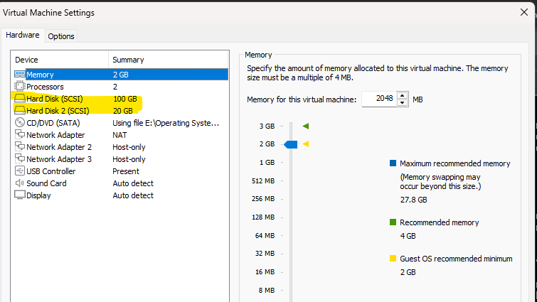

# List,Create,Delete&Modify Physical Storage Partitions



There are two hard disk in Ubuntu Server VM.

```bash
server@ubuntuserver:~$ lsblk
NAME                      MAJ:MIN RM  SIZE RO TYPE MOUNTPOINTS
loop0                       7:0    0 63.7M  1 loop /snap/core20/2434
loop1                       7:1    0 70.5M  1 loop /snap/powershell/281
loop2                       7:2    0 63.7M  1 loop /snap/core20/2496
loop3                       7:3    0 73.7M  1 loop /snap/powershell/283
loop4                       7:4    0 44.4M  1 loop /snap/snapd/23545
sda                         8:0    0  100G  0 disk
├─sda1                      8:1    0    1M  0 part
├─sda2                      8:2    0    2G  0 part /boot
└─sda3                      8:3    0   98G  0 part
  └─ubuntu--vg-ubuntu--lv 252:0    0   49G  0 lvm  /
sdb                         8:16   0   20G  0 disk
sr0                        11:0    1  2.6G  0 rom
```

As we can see, the first disk is “sda” and the second disk is “sdb” in this vm. There are three partitions in first storage device which is “sda”. They are “sda1”, “sda2” and “sda3”.

All of these block devices are referenced by files found in “/dev/” directory.

```bash
server@ubuntuserver:/dev$ ls | grep "^sd*"
sda
sda1
sda2
sda3
sdb
sg0
sg1
sg2
shm
snapshot
snd
sr0
stderr
stdin
stdout

/dev/sda # => Point to a entire device 
/dev/sda1 # => Point to a partition
```

### Pre-installed partition utility

⇒ fdisk

```bash
server@ubuntuserver:/dev$ sudo fdisk --list /dev/sda
Disk /dev/sda: 100 GiB, 107374182400 bytes, 209715200 sectors
Disk model: VMware Virtual S
Units: sectors of 1 * 512 = 512 bytes
Sector size (logical/physical): 512 bytes / 512 bytes
I/O size (minimum/optimal): 512 bytes / 512 bytes
Disklabel type: gpt
Disk identifier: 7C8ADD78-7489-4323-8C2B-88665DA83EF1

Device       Start       End   Sectors Size Type
/dev/sda1     2048      4095      2048   1M BIOS boot
/dev/sda2     4096   4198399   4194304   2G Linux filesystem
/dev/sda3  4198400 209713151 205514752  98G Linux filesystem
```

If we see that, sector 0 ~ 2047 are not partitioned because it is a standard procedure to leave One Meg free of unpartitioned space at the beginning. This is done in case a special program called a boot loader needs be installed in that area.

fdisk ⇒ can be used to create and delete partitions. 

Let’s partition the second storage device 

```bash
server@ubuntuserver:/dev$ sudo cfdisk /dev/sdb
```


Previously, “MBR” type was widely used and now most of the system migrated to “gpt”.  

Advantageous of GPT 

⇒ The partition table is less like to get corrupted

⇒ We can have many more primary partition, much larger partition size and so on.

In this lab, we will choose ‘gpt’ and if we want to choose “MBR”, we can select “dos”. 

Select the free space 


Select “New” and 15G 


Now, we partition size of sdb1 is 15G. Lets create another partition for remaining free space.


Now let’s resize the sdb1 partition from 15G to 10G and we need to navigate back to “/dev/sdb1” and select resize. 


Let’s use the sdb3 for swap usage and we will change the type of sdb3 from “Linux Filesystem” to “Linux Swap”


If we want to create the boot partition, the partition type is “EFI”


Now lets confirm our setting.


Now let’s confirm our setting.

```bash
server@ubuntuserver:/dev$ sudo fdisk --list /dev/sdb
Disk /dev/sdb: 20 GiB, 21474836480 bytes, 41943040 sectors
Disk model: VMware Virtual S
Units: sectors of 1 * 512 = 512 bytes
Sector size (logical/physical): 512 bytes / 512 bytes
I/O size (minimum/optimal): 512 bytes / 512 bytes
Disklabel type: gpt
Disk identifier: 3641D574-90B1-4185-B791-30C7B130E9E7

Device        Start      End  Sectors Size Type
/dev/sdb1      2048 20973567 20971520  10G Linux filesystem
/dev/sdb2  20973568 31459327 10485760   5G Linux filesystem
/dev/sdb3  31459328 41940991 10481664   5G Linux swap
```

```bash
server@ubuntuserver:/dev$ lsblk
NAME                      MAJ:MIN RM  SIZE RO TYPE MOUNTPOINTS
loop0                       7:0    0 63.7M  1 loop /snap/core20/2434
loop1                       7:1    0 70.5M  1 loop /snap/powershell/281
loop2                       7:2    0 63.7M  1 loop /snap/core20/2496
loop3                       7:3    0 73.7M  1 loop /snap/powershell/283
loop4                       7:4    0 44.4M  1 loop /snap/snapd/23545
loop5                       7:5    0 44.4M  1 loop /snap/snapd/23771
sda                         8:0    0  100G  0 disk
├─sda1                      8:1    0    1M  0 part
├─sda2                      8:2    0    2G  0 part /boot
└─sda3                      8:3    0   98G  0 part
  └─ubuntu--vg-ubuntu--lv 252:0    0   49G  0 lvm  /
sdb                         8:16   0   20G  0 disk
├─sdb1                      8:17   0   10G  0 part
├─sdb2                      8:18   0    5G  0 part
└─sdb3                      8:19   0    5G  0 part
sr0                        11:0    1  2.6G  0 rom
```