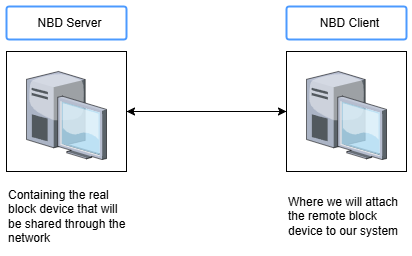

# Network Block Device



### Configuration at the server side

Step 1: Install nbd-server package 

```bash
server@ubuntuserver:~$ sudo apt-get install nbd-server
[sudo] password for server:
Reading package lists... Done
Building dependency tree... Done
Reading state information... Done
The following NEW packages will be installed:
  nbd-server
0 upgraded, 1 newly installed, 0 to remove and 136 not upgraded.
Need to get 63.3 kB of archives.
After this operation, 184 kB of additional disk space will be used.
Get:1 http://us.archive.ubuntu.com/ubuntu noble-updates/main amd64 nbd-server amd64 1:3.26.1-1ubuntu0.1 [63.3 kB]
Fetched 63.3 kB in 0s (146 kB/s)
Preconfiguring packages ...
Selecting previously unselected package nbd-server.
(Reading database ... 122037 files and directories currently installed.)
Preparing to unpack .../nbd-server_1%3a3.26.1-1ubuntu0.1_amd64.deb ...
Unpacking nbd-server (1:3.26.1-1ubuntu0.1) ...
Setting up nbd-server (1:3.26.1-1ubuntu0.1) ...

Creating config file /etc/nbd-server/config with new version
info: Selecting UID from range 100 to 999 ...

info: Selecting GID from range 100 to 999 ...
info: Adding system user `nbd' (UID 112) ...
info: Adding new group `nbd' (GID 110) ...
info: Adding new user `nbd' (UID 112) with group `nbd' ...
info: Not creating home directory `/etc/nbd-server'.
Processing triggers for man-db (2.12.0-4build2) ...
Scanning processes...
Scanning linux images...

Running kernel seems to be up-to-date.

No services need to be restarted.

No containers need to be restarted.

No user sessions are running outdated binaries.

No VM guests are running outdated hypervisor (qemu) binaries on this host.
```

Step 2 : Edit the configuration file of nbd-server

We can edit the configuration of nbd-server in “/etc/nbd-server/config”.

```bash
server@ubuntuserver:~$ sudo cat /etc/nbd-server/config
[generic]
# If you want to run everything as root rather than the nbd user, you
# may either say "root" in the two following lines, or remove them
# altogether. Do not remove the [generic] section, however.
        user = nbd
        group = nbd
        includedir = /etc/nbd-server/conf.d

# What follows are export definitions. You may create as much of them as
# you want, but the section header has to be unique.
```

In that configuration file,

allowlist = true [Purpose : to list what exports the server has available. Essentially, we can see what block devices it can share with us]

We also need to add export definition to specify what block devices we want to share. 

Before that, we will list the block devices in our server.

```bash
server@ubuntuserver:~$ lsblk -f /dev/sdb
NAME   FSTYPE FSVER LABEL    UUID                                 FSAVAIL FSUSE% MOUNTPOINTS
sdb
├─sdb1 xfs          FirstFS  4105ca36-ce58-4335-bc5a-01f7f2346b18    4.8G     3% /mnt/sdb1
├─sdb2 ext4   1.0   SecondFS 1da15428-14e2-47a0-b3f2-9894cf6398de    4.5G     0% /mnt/sdb2
├─sdb3 ext4   1.0   ThirdFS  00ec6c37-5ace-42d3-87f8-a91dcb02f7f2    4.6G     0% /mnt/sdb3
└─sdb4 swap   1              59e4fc0f-e586-4682-9cc3-73d269f65583                [SWAP]
```

Then, we edit the config file as per following

```bash
server@ubuntuserver:~$ sudo cat /etc/nbd-server/config
[sudo] password for server:
[generic]
# If you want to run everything as root rather than the nbd user, you
# may either say "root" in the two following lines, or remove them
# altogether. Do not remove the [generic] section, however.
#       user = nbd
#       group = nbd
        includedir = /etc/nbd-server/conf.d
        allowlist = true
# What follows are export definitions. You may create as much of them as
# you want, but the section header has to be unique.
[partition3]
        exportname=/dev/sdb3
        
server@ubuntuserver:~$ sudo systemctl restart nbd-server.service
        
server@ubuntuserver:~$ sudo reboot
```

allowlist = true [Purpose : to list what exports the server has available. Essentially, we can see what block devices it can share with us]

We define the definition for /dev/sdb3 as partition 3.

In order to get help for the NBD server config file, we can type 

```bash
man 5 nbd-server
```

### Configuration at the client side

Step 1: Install the nbd-client package at the client machine.

At the NBD-Client side

```bash
client@ubuntuclient:~$ sudo apt-get install nbd-client
[sudo] password for client:
Reading package lists... Done
Building dependency tree... Done
Reading state information... Done
The following NEW packages will be installed:
  nbd-client
0 upgraded, 1 newly installed, 0 to remove and 135 not upgraded.
Need to get 43.6 kB of archives.
After this operation, 131 kB of additional disk space will be used.
Get:1 http://us.archive.ubuntu.com/ubuntu noble-updates/universe amd64 nbd-client amd64 1:3.26.1-1ubuntu0.1 [43.6 kB]
Fetched 43.6 kB in 0s (106 kB/s)
Preconfiguring packages ...
Selecting previously unselected package nbd-client.
(Reading database ... 121989 files and directories currently installed.)
Preparing to unpack .../nbd-client_1%3a3.26.1-1ubuntu0.1_amd64.deb ...
Unpacking nbd-client (1:3.26.1-1ubuntu0.1) ...
Setting up nbd-client (1:3.26.1-1ubuntu0.1) ...
update-initramfs: deferring update (trigger activated)
update-rc.d: warning: start and stop actions are no longer supported; falling back to defaults
Processing triggers for man-db (2.12.0-4build2) ...
Processing triggers for initramfs-tools (0.142ubuntu25.1) ...
update-initramfs: Generating /boot/initrd.img-6.8.0-54-generic
Scanning processes...
Scanning linux images...

Running kernel seems to be up-to-date.

No services need to be restarted.

No containers need to be restarted.

No user sessions are running outdated binaries.

No VM guests are running outdated hypervisor (qemu) binaries on this host.
```

Step 2: Load the nbd kernel module.

Next we need to load the kernel module to extend the kernel functionality to handle the remote network block. 

```bash
client@ubuntuclient:~$ sudo modprobe nbd
```

But this command line will only load nbd module in the current boot. In order to load the nbd module every time operating system start, we can tell ubuntu or debian OS what additional module to load at each boot. We need to edit the following file 

```bash
client@ubuntuclient:~$ sudo cat /etc/modules-load.d/modules.conf
# /etc/modules is obsolete and has been replaced by /etc/modules-load.d/.
# Please see modules-load.d(5) and modprobe.d(5) for details.
#
# Updating this file still works, but it is undocumented and unsupported.
```

We will put the nbd in modules.conf file.

```bash
client@ubuntuclient:~$ sudo cat /etc/modules-load.d/modules.conf
# /etc/modules is obsolete and has been replaced by /etc/modules-load.d/.
# Please see modules-load.d(5) and modprobe.d(5) for details.
#
# Updating this file still works, but it is undocumented and unsupported.
nbd
```

Since we enable firewall service, we allow nbd protocol at the server machine.

At nbd-server side

```bash
server@ubuntuserver:~$ sudo ufw insert 3 allow from 192.168.211.0/24 to any port nbd
Rule inserted
server@ubuntuserver:~$ sudo ufw delete 4
Deleting:
 deny out on ens33 to 192.168.211.136
Proceed with operation (y|n)? n
Aborted
server@ubuntuserver:~$ sudo ufw status numbered
Status: active

     To                         Action      From
     --                         ------      ----
[ 1] 22                         ALLOW IN    192.168.211.0/24
[ 2] 2049                       ALLOW IN    192.168.211.0/24
[ 3] 10809/tcp                  ALLOW IN    192.168.211.0/24
[ 4] 192.168.211.136            DENY OUT    Anywhere on ens33          (out)
```

At the nbd-client side, we install the exported block device which is partition3 from the server side and mount /dev/nbd0 at /nbd/nbd0

```bash
client@ubuntuclient:~$ sudo nbd-client server -N partition3
Negotiation: ..size = 5120MB
Connected /dev/nbd0

client@ubuntuclient:/mnt$ sudo su root
root@ubuntuclient:/# sudo mkdir -p /nbd/nbd0/

client@ubuntuclient:~$ sudo mount /dev/nbd0 /nbd/nbd0/
```

At the nbd-server side, we will now create the “nbd_test1.txt” file in mounted point of sdb3 partition.

```bash
server@ubuntuserver:/mnt/sdb3$ lsblk -f /dev/sdb3
NAME FSTYPE FSVER LABEL   UUID                                 FSAVAIL FSUSE% MOUNTPOINTS
sdb3 ext4   1.0   ThirdFS 00ec6c37-5ace-42d3-87f8-a91dcb02f7f2    4.6G     0% /mnt/sdb3

server@ubuntuserver:~$ cd /mnt/sdb3/
server@ubuntuserver:/mnt/sdb3$ sudo touch nbd_test1.txt
[sudo] password for server:

server@ubuntuserver:/mnt/sdb3$ ls -l
total 16
drwx------ 2 root root 16384 Mar  8 21:09 lost+found
-rw-r--r-- 1 root root     0 Mar  8 21:31 nbd_test1.txt
```

At the nbd-client side, we now see nbd_test1.txt file at nbd/nbd0

```bash
client@ubuntuclient:~$ ls /nbd/nbd0/
lost+found  nbd_test1.txt

client@ubuntuclient:~$ lsblk -f /dev/nbd0
NAME FSTYPE FSVER LABEL   UUID                                 FSAVAIL FSUSE% MOUNTPOINTS
nbd0 ext4   1.0   ThirdFS 00ec6c37-5ace-42d3-87f8-a91dcb02f7f2    4.6G     0% /nbd/nbd0

client@ubuntuclient:~$ sudo umount /nbd/nbd0
```

To disconnect the network block device we can use ‘-d’ flag.

```bash
client@ubuntuclient:~$ sudo nbd-client -d /dev/nbd0

client@ubuntuclient:~$ lsblk -f /dev/nbd0
NAME FSTYPE FSVER LABEL UUID FSAVAIL FSUSE% MOUNTPOINTS
nbd0
```

nbd-client can check the export list with -l option 

```bash
client@ubuntuclient:~$ sudo nbd-client -l server
Negotiation: ..
partition3
```

Let’s reconnect the partition3 back.

```bash
client@ubuntuclient:~$ sudo nbd-client server -N partition3
Negotiation: ..size = 5120MB
Connected /dev/nbd0
```

### Configuring to connect the partition3 everytime OS boot

At the client side, we will create the systemctl file with the nbd-client.service at the directory path “/etc/systemd/system/” with the name “nbd-client.service”

```bash
client@ubuntuclient:/etc/systemd$ sudo vim /etc/systemd/system/nbd-client.service
client@ubuntuclient:/etc/systemd$ sudo cat /etc/systemd/system/nbd-client.service
[Unit]
Description=NBD Client Connection
After=network.target
Before=remote-fs.target

[Service]
ExecStart=/usr/sbin/nbd-client server -N partition3 /dev/nbd0
ExecStop=/usr/sbin/nbd-client -d /dev/nbd0
Restart=always
RemainAfterExit=yes

[Install]
WantedBy=multi-user.target
```

Let’s enable the nbd-client service we create.

```bash
client@ubuntuclient:/etc/systemd$ sudo systemctl daemon-reload
client@ubuntuclient:/etc/systemd$ sudo systemctl enable nbd-client
Synchronizing state of nbd-client.service with SysV service script with /usr/lib/systemd/systemd-sysv-install.
Executing: /usr/lib/systemd/systemd-sysv-install enable nbd-client
Created symlink /etc/systemd/system/multi-user.target.wants/nbd-client.service → /etc/systemd/system/nbd-client.service.
client@ubuntuclient:/etc/systemd$ sudo systemctl start nbd-client
client@ubuntuclient:/etc/systemd$ lsblk -f /dev/nbd0
NAME FSTYPE FSVER LABEL   UUID                                 FSAVAIL FSUSE% MOUNTPOINTS
nbd0 ext4   1.0   ThirdFS 00ec6c37-5ace-42d3-87f8-a91dcb02f7f2
client@ubuntuclient:/etc/systemd$
```

Let’s reboot th emachine.

```bash
client@ubuntuclient:/etc/systemd$ sudo reboot

Broadcast message from root@ubuntuclient on pts/1 (Sat 2025-03-08 22:19:08 UTC):

The system will reboot now!

client@ubuntuclient:/etc/systemd$ client_loop: send disconnect: Connection reset
PS C:\Users\soeye> ssh client@192.168.211.129
client@192.168.211.129's password:
Welcome to Ubuntu 24.04.1 LTS (GNU/Linux 6.8.0-54-generic x86_64)

 * Documentation:  https://help.ubuntu.com
 * Management:     https://landscape.canonical.com
 * Support:        https://ubuntu.com/pro

 System information as of Sat Mar  8 10:19:28 PM UTC 2025

  System load:  1.18               Processes:              275
  Usage of /:   11.3% of 47.93GB   Users logged in:        0
  Memory usage: 15%                IPv4 address for ens33: 192.168.211.129
  Swap usage:   0%

 * Strictly confined Kubernetes makes edge and IoT secure. Learn how MicroK8s
   just raised the bar for easy, resilient and secure K8s cluster deployment.

   https://ubuntu.com/engage/secure-kubernetes-at-the-edge

Expanded Security Maintenance for Applications is not enabled.

131 updates can be applied immediately.
To see these additional updates run: apt list --upgradable

Enable ESM Apps to receive additional future security updates.
See https://ubuntu.com/esm or run: sudo pro status

Last login: Sat Mar  8 22:13:14 2025 from 192.168.211.1\

client@ubuntuclient:~$ lsblk -f /dev/nbd0
NAME FSTYPE FSVER LABEL   UUID                                 FSAVAIL FSUSE% MOUNTPOINTS
nbd0 ext4   1.0   ThirdFS 00ec6c37-5ace-42d3-87f8-a91dcb02f7f2
```

After reboot, we can clearly see that the client machine is connected with ndb-server at /dev/nbd0