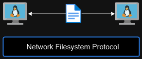
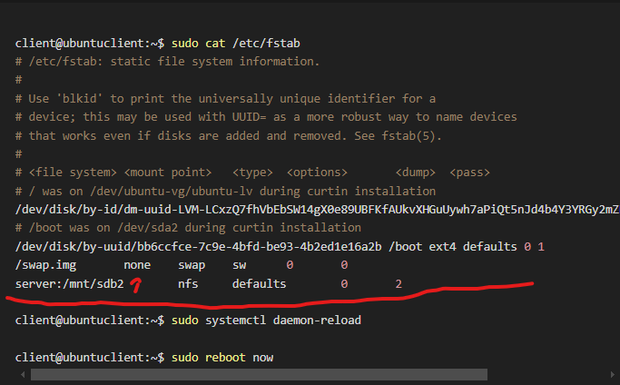

# Use Remote Filesystems: NFS

Network File System Protocol is used to share the data between two linux computers. 



There are two main components in using NFS. 

1. NFS Server
2. NFS Client 

### Configuring the NFS Server

**Step 1: Install nfs-kernel-server package**

At the NFS Server side

```bash
server@ubuntuserver:~$ sudo apt install nfs-kernel-server
[sudo] password for server:
Reading package lists... Done
Building dependency tree... Done
Reading state information... Done
The following additional packages will be installed:
  keyutils libnfsidmap1 nfs-common rpcbind
Suggested packages:
  watchdog
The following NEW packages will be installed:
  keyutils libnfsidmap1 nfs-common nfs-kernel-server rpcbind
0 upgraded, 5 newly installed, 0 to remove and 136 not upgraded.
Need to get 569 kB of archives.
After this operation, 2,022 kB of additional disk space will be used.
Do you want to continue? [Y/n] Y
Get:1 http://us.archive.ubuntu.com/ubuntu noble-updates/main amd64 libnfsidmap1 amd64 1:2.6.4-3ubuntu5.1 [48.3 kB]
Get:2 http://us.archive.ubuntu.com/ubuntu noble/main amd64 rpcbind amd64 1.2.6-7ubuntu2 [46.5 kB]
Get:3 http://us.archive.ubuntu.com/ubuntu noble/main amd64 keyutils amd64 1.6.3-3build1 [56.8 kB]
Get:4 http://us.archive.ubuntu.com/ubuntu noble-updates/main amd64 nfs-common amd64 1:2.6.4-3ubuntu5.1 [248 kB]
Get:5 http://us.archive.ubuntu.com/ubuntu noble-updates/main amd64 nfs-kernel-server amd64 1:2.6.4-3ubuntu5.1 [169 kB]
Fetched 569 kB in 1s (590 kB/s)
Selecting previously unselected package libnfsidmap1:amd64.
(Reading database ... 121861 files and directories currently installed.)
Preparing to unpack .../libnfsidmap1_1%3a2.6.4-3ubuntu5.1_amd64.deb ...
Unpacking libnfsidmap1:amd64 (1:2.6.4-3ubuntu5.1) ...
Selecting previously unselected package rpcbind.
Preparing to unpack .../rpcbind_1.2.6-7ubuntu2_amd64.deb ...
Unpacking rpcbind (1.2.6-7ubuntu2) ...
Selecting previously unselected package keyutils.
Preparing to unpack .../keyutils_1.6.3-3build1_amd64.deb ...
Unpacking keyutils (1.6.3-3build1) ...
Selecting previously unselected package nfs-common.
Preparing to unpack .../nfs-common_1%3a2.6.4-3ubuntu5.1_amd64.deb ...
Unpacking nfs-common (1:2.6.4-3ubuntu5.1) ...
Selecting previously unselected package nfs-kernel-server.
Preparing to unpack .../nfs-kernel-server_1%3a2.6.4-3ubuntu5.1_amd64.deb ...
Unpacking nfs-kernel-server (1:2.6.4-3ubuntu5.1) ...
Setting up libnfsidmap1:amd64 (1:2.6.4-3ubuntu5.1) ...
Setting up rpcbind (1.2.6-7ubuntu2) ...
Created symlink /etc/systemd/system/multi-user.target.wants/rpcbind.service → /usr/lib/systemd/system/rpcbind.service.
Created symlink /etc/systemd/system/sockets.target.wants/rpcbind.socket → /usr/lib/systemd/system/rpcbind.socket.
Setting up keyutils (1.6.3-3build1) ...
Setting up nfs-common (1:2.6.4-3ubuntu5.1) ...

Creating config file /etc/idmapd.conf with new version

Creating config file /etc/nfs.conf with new version
info: Selecting UID from range 100 to 999 ...

info: Adding system user `statd' (UID 111) ...
info: Adding new user `statd' (UID 111) with group `nogroup' ...
info: Not creating home directory `/var/lib/nfs'.
Created symlink /etc/systemd/system/multi-user.target.wants/nfs-client.target → /usr/lib/systemd/system/nfs-client.target.
Created symlink /etc/systemd/system/remote-fs.target.wants/nfs-client.target → /usr/lib/systemd/system/nfs-client.target
.
auth-rpcgss-module.service is a disabled or a static unit, not starting it.
nfs-idmapd.service is a disabled or a static unit, not starting it.
nfs-utils.service is a disabled or a static unit, not starting it.
proc-fs-nfsd.mount is a disabled or a static unit, not starting it.
rpc-gssd.service is a disabled or a static unit, not starting it.
rpc-statd-notify.service is a disabled or a static unit, not starting it.
rpc-statd.service is a disabled or a static unit, not starting it.
rpc-svcgssd.service is a disabled or a static unit, not starting it.
Setting up nfs-kernel-server (1:2.6.4-3ubuntu5.1) ...
Created symlink /etc/systemd/system/nfs-mountd.service.requires/fsidd.service → /usr/lib/systemd/system/fsidd.service.
Created symlink /etc/systemd/system/nfs-server.service.requires/fsidd.service → /usr/lib/systemd/system/fsidd.service.
Created symlink /etc/systemd/system/nfs-client.target.wants/nfs-blkmap.service → /usr/lib/systemd/system/nfs-blkmap.service.
Created symlink /etc/systemd/system/multi-user.target.wants/nfs-server.service → /usr/lib/systemd/system/nfs-server.service.
nfs-mountd.service is a disabled or a static unit, not starting it.
nfsdcld.service is a disabled or a static unit, not starting it.

Creating config file /etc/exports with new version

Creating config file /etc/default/nfs-kernel-server with new version
Processing triggers for man-db (2.12.0-4build2) ...
Processing triggers for libc-bin (2.39-0ubuntu8.4) ...
Scanning processes...
Scanning candidates...
Scanning linux images...

Pending kernel upgrade!
Running kernel version:
  6.8.0-54-generic
Diagnostics:
  The currently running kernel version is not the expected kernel version 6.8.0-55-generic.

Restarting the system to load the new kernel will not be handled automatically, so you should consider rebooting.

No services need to be restarted.

No containers need to be restarted.

User sessions running outdated binaries:
 server @ session #1: sshd[1198]

No VM guests are running outdated hypervisor (qemu) binaries on this host.
```

**Step 2: Inform the NFS server which file systems or directories we want to share by editing /etc/exports file** 

```bash
server@ubuntuserver:~$ cat /etc/exports
# /etc/exports: the access control list for filesystems which may be exported
#               to NFS clients.  See exports(5).
#
# Example for NFSv2 and NFSv3:
# /srv/homes       hostname1(rw,sync,no_subtree_check) hostname2(ro,sync,no_subtree_check)
#
# Example for NFSv4:
# /srv/nfs4        gss/krb5i(rw,sync,fsid=0,crossmnt,no_subtree_check)
# /srv/nfs4/homes  gss/krb5i(rw,sync,no_subtree_check)
#
```

Allow us to explain how to define our shared folder in the file system.

/srv/home = The path into the directory we want to share 

hostname1(rw,sync,no_subtree_check) = NFS Client with read-write permssion and rw,sync,no_subtree_check are the export options (no_subtree_check = disable subtree checking)

no_root_squash = allow root user to have root privileges  

hostname2(ro,sync,no_subtree_check) = another NFS client with RO permission (read-only)

> To see info about the /etc/exports file, use this command: man exports
> 

We add the “/mnt/sdb2       client(rw,sync,no_subtree_check)” line in /etc/exports at server machine. 

At the NFS Server side

```bash
server@ubuntuserver:~$ cat /etc/exports
# /etc/exports: the access control list for filesystems which may be exported
#               to NFS clients.  See exports(5).
#
# Example for NFSv2 and NFSv3:
# /srv/homes       hostname1(rw,sync,no_subtree_check) hostname2(ro,sync,no_subtree_check)
/mnt/sdb2       client(rw,sync,no_subtree_check)
```

Let’s refresh the export file and verbose it. 

```bash
server@ubuntuserver:~$ sudo exportfs -r
server@ubuntuserver:~$ sudo exportfs -v
/mnt/sdb2       client(sync,wdelay,hide,no_subtree_check,sec=sys,rw,secure,root_squash,no_all_squash)
```

### Configuring the NFS Client

**Step 1: Install nfs-common package at the client side**

At the client side 

```bash
client@ubuntuclient:/mnt$ sudo apt install -y nfs-common
[sudo] password for client:
Reading package lists... Done
Building dependency tree... Done
Reading state information... Done
The following additional packages will be installed:
  keyutils libnfsidmap1 rpcbind
Suggested packages:
  watchdog
The following NEW packages will be installed:
  keyutils libnfsidmap1 nfs-common rpcbind
0 upgraded, 4 newly installed, 0 to remove and 135 not upgraded.
Need to get 400 kB of archives.
After this operation, 1,416 kB of additional disk space will be used.
Get:1 http://us.archive.ubuntu.com/ubuntu noble-updates/main amd64 libnfsidmap1 amd64 1:2.6.4-3ubuntu5.1 [48.3 kB]
Get:2 http://us.archive.ubuntu.com/ubuntu noble/main amd64 rpcbind amd64 1.2.6-7ubuntu2 [46.5 kB]
Get:3 http://us.archive.ubuntu.com/ubuntu noble/main amd64 keyutils amd64 1.6.3-3build1 [56.8 kB]
Get:4 http://us.archive.ubuntu.com/ubuntu noble-updates/main amd64 nfs-common amd64 1:2.6.4-3ubuntu5.1 [248 kB]
Fetched 400 kB in 1s (513 kB/s)
Selecting previously unselected package libnfsidmap1:amd64.
(Reading database ... 121857 files and directories currently installed.)
Preparing to unpack .../libnfsidmap1_1%3a2.6.4-3ubuntu5.1_amd64.deb ...
Unpacking libnfsidmap1:amd64 (1:2.6.4-3ubuntu5.1) ...
Selecting previously unselected package rpcbind.
Preparing to unpack .../rpcbind_1.2.6-7ubuntu2_amd64.deb ...
Unpacking rpcbind (1.2.6-7ubuntu2) ...
Selecting previously unselected package keyutils.
Preparing to unpack .../keyutils_1.6.3-3build1_amd64.deb ...
Unpacking keyutils (1.6.3-3build1) ...
Selecting previously unselected package nfs-common.
Preparing to unpack .../nfs-common_1%3a2.6.4-3ubuntu5.1_amd64.deb ...
Unpacking nfs-common (1:2.6.4-3ubuntu5.1) ...
Setting up libnfsidmap1:amd64 (1:2.6.4-3ubuntu5.1) ...
Setting up rpcbind (1.2.6-7ubuntu2) ...
Created symlink /etc/systemd/system/multi-user.target.wants/rpcbind.service → /usr/lib/systemd/system/rpcbind.service.
Created symlink /etc/systemd/system/sockets.target.wants/rpcbind.socket → /usr/lib/systemd/system/rpcbind.socket.
Setting up keyutils (1.6.3-3build1) ...
Setting up nfs-common (1:2.6.4-3ubuntu5.1) ...

Creating config file /etc/idmapd.conf with new version

Creating config file /etc/nfs.conf with new version
info: Selecting UID from range 100 to 999 ...

info: Adding system user `statd' (UID 111) ...
info: Adding new user `statd' (UID 111) with group `nogroup' ...
info: Not creating home directory `/var/lib/nfs'.
Created symlink /etc/systemd/system/multi-user.target.wants/nfs-client.target → /usr/lib/systemd/system/nfs-client.target.
Created symlink /etc/systemd/system/remote-fs.target.wants/nfs-client.target → /usr/lib/systemd/system/nfs-client.target
.
auth-rpcgss-module.service is a disabled or a static unit, not starting it.
nfs-idmapd.service is a disabled or a static unit, not starting it.
nfs-utils.service is a disabled or a static unit, not starting it.
proc-fs-nfsd.mount is a disabled or a static unit, not starting it.
rpc-gssd.service is a disabled or a static unit, not starting it.
rpc-statd-notify.service is a disabled or a static unit, not starting it.
rpc-statd.service is a disabled or a static unit, not starting it.
rpc-svcgssd.service is a disabled or a static unit, not starting it.
Processing triggers for man-db (2.12.0-4build2) ...
Processing triggers for libc-bin (2.39-0ubuntu8.4) ...
Scanning processes...
Scanning linux images...

Running kernel seems to be up-to-date.

No services need to be restarted.

No containers need to be restarted.

No user sessions are running outdated binaries.

No VM guests are running outdated hypervisor (qemu) binaries on this host.
client@ubuntuclient:/mnt$
```

**Step 2: mount the NFS Share at the client side** 

The general syntax to mount a remote NFS Share is 

sudo mount IP_or_hostname_of_server:/path/to/remote/directory /path/to/local/directory

```bash
client@ubuntuclient:/mnt$ sudo mount server:/mnt/sdb2 /nfs/sharedrive
```

Mounting step was stuck at the first because I enable the firewall service and therefore I temporarily disable the firewall service in server and client side. 

```bash
client@ubuntuclient:/nfs/sharedrive$ sudo ufw disable

client@ubuntuclient:/mnt$ sudo mount server:/mnt/sdb2 /nfs/sharedrive

client@ubuntuclient:/nfs/sharedrive$ df -h
Filesystem                         Size  Used Avail Use% Mounted on
tmpfs                              192M  1.3M  191M   1% /run
/dev/mapper/ubuntu--vg-ubuntu--lv   48G  5.3G   41G  12% /
tmpfs                              960M     0  960M   0% /dev/shm
tmpfs                              5.0M     0  5.0M   0% /run/lock
/dev/sda2                          2.0G  184M  1.7G  11% /boot
tmpfs                              192M   12K  192M   1% /run/user/1002
server:/mnt/sdb2                   4.8G     0  4.6G   0% /nfs/sharedrive
```

At the server side we will create empty file with the name “server_share_file1.txt” in /mnt/sdb2

At the NFS Server side 

```bash
server@ubuntuserver:~$ sudo touch /mnt/sdb2/server_share_file.txt
server@ubuntuserver:~$ ls /mnt/sdb2/
lost+found  server_share_file.txt  test1.txt
```

At the NFS Client Side

```bash
client@ubuntuclient:/nfs/sharedrive$ ls
lost+found  server_share_file.txt  test1.txt
client@ubuntuclient:/nfs/sharedrive$
```

Lets unmount and edit the firewall rule to allow the NFS protocol in the firewall rule.

```bash
client@ubuntuclient:~$ sudo umount /nfs/sharedrive

client@ubuntuclient:~$ ls -l /nfs/sharedrive/
total 0

client@ubuntuclient:~$ sudo ufw enable
Command may disrupt existing ssh connections. Proceed with operation (y|n)? y
Firewall is active and enabled on system startup
```

At the NFS Client Side

```bash
client@ubuntuclient:~$ sudo ufw status numbered
Status: active

     To                         Action      From
     --                         ------      ----
[ 1] 22 on ens33                ALLOW IN    192.168.211.0/24
[ 2] 192.168.211.137            DENY OUT    Anywhere on ens33          (out)
[ 3] 192.168.211.137/udp        DENY OUT    Anywhere on ens33          (out)
```

At the NFS Server, we activate the firewall and check the rules.

```bash
server@ubuntuserver:~$ sudo ufw enable
Command may disrupt existing ssh connections. Proceed with operation (y|n)? y
Firewall is active and enabled on system startup

server@ubuntuserver:~$ sudo ufw status numbered
Status: active

     To                         Action      From
     --                         ------      ----
[ 1] 22                         ALLOW IN    192.168.211.0/24
[ 2] 192.168.211.136            DENY OUT    Anywhere on ens33          (out)
```

At the client side, we allow nfs protocol from 192.168.211.0/24 network at rule number 2.

```bash
client@ubuntuclient:~$ sudo ufw insert 2 allow from 192.168.211.0/24 to any port nfs
Rule inserted
client@ubuntuclient:~$ sudo ufw status numbered
Status: active

     To                         Action      From
     --                         ------      ----
[ 1] 22 on ens33                ALLOW IN    192.168.211.0/24
[ 2] 2049                       ALLOW IN    192.168.211.0/24
[ 3] 192.168.211.137            DENY OUT    Anywhere on ens33          (out)
[ 4] 192.168.211.137/udp        DENY OUT    Anywhere on ens33          (out)
```

However, we cannot still mount the server shared drive to client because we also need to allow nfs protocol at the server side too.

```bash
client@ubuntuclient:~$ sudo mount server:/mnt/sdb2 /nfs/sharedrive/
```

At the server side, we allow nfs protocol from 192.168.211.0/24 network at rule number 2.

```bash
server@ubuntuserver:~$ sudo ufw insert 2 allow from 192.168.211.0/24 to any port nfs
Rule inserted
server@ubuntuserver:~$ sudo ufw status numbered
Status: active

     To                         Action      From
     --                         ------      ----
[ 1] 22                         ALLOW IN    192.168.211.0/24
[ 2] 2049                       ALLOW IN    192.168.211.0/24
[ 3] 192.168.211.136            DENY OUT    Anywhere on ens33          (out)
```

Now we can mount back the server’s shared folder to client.

```bash
client@ubuntuclient:~$ sudo mount server:/mnt/sdb2 /nfs/sharedrive/
client@ubuntuclient:~$ df -h
Filesystem                         Size  Used Avail Use% Mounted on
tmpfs                              192M  1.3M  191M   1% /run
/dev/mapper/ubuntu--vg-ubuntu--lv   48G  5.3G   41G  12% /
tmpfs                              960M     0  960M   0% /dev/shm
tmpfs                              5.0M     0  5.0M   0% /run/lock
/dev/sda2                          2.0G  184M  1.7G  11% /boot
tmpfs                              192M   12K  192M   1% /run/user/1002
server:/mnt/sdb2                   4.8G     0  4.6G   0% /nfs/sharedrive
```

### **Implementation of Persistent Mounting**

We will now persistent mount shared drive from server at the client side.

At the NFS client

```bash
client@ubuntuclient:~$ sudo cat /etc/fstab
# /etc/fstab: static file system information.
#
# Use 'blkid' to print the universally unique identifier for a
# device; this may be used with UUID= as a more robust way to name devices
# that works even if disks are added and removed. See fstab(5).
#
# <file system> <mount point>   <type>  <options>       <dump>  <pass>
# / was on /dev/ubuntu-vg/ubuntu-lv during curtin installation
/dev/disk/by-id/dm-uuid-LVM-LCxzQ7fhVbEbSW14gX0e89UBFKfAUkvXHGuUywh7aPiQt5nJd4b4Y3YRGy2mZKZu / ext4 defaults 0 1
# /boot was on /dev/sda2 during curtin installation
/dev/disk/by-uuid/bb6ccfce-7c9e-4bfd-be93-4b2ed1e16a2b /boot ext4 defaults 0 1
/swap.img       none    swap    sw      0       0
server:/mnt/sdb2        nfs     defaults        0       2

client@ubuntuclient:~$ sudo systemctl daemon-reload

client@ubuntuclient:~$ sudo reboot now
```

At the server side, we create empty file named with “after_reboot.txt”

```bash
server@ubuntuserver:~$ sudo touch /mnt/sdb2/after_reboot.txt
server@ubuntuserver:~$ ls -l /mnt/sdb2/
total 16
-rw-r--r-- 1 root root     0 Mar  8 09:14 after_reboot.txt
drwx------ 2 root root 16384 Mar  7 08:04 lost+found
-rw-r--r-- 1 root root     0 Mar  8 08:57 server_share_file.txt
-rw-r--r-- 1 root root     0 Mar  8 07:06 test1.txt
```

But we still cannot see the shared folder at the client side this is because we forgot to inform the mount point at fstab file.



At the NFS Client side

```bash
client@ubuntuclient:~$ df -h
Filesystem                         Size  Used Avail Use% Mounted on
tmpfs                              192M  1.3M  191M   1% /run
/dev/mapper/ubuntu--vg-ubuntu--lv   48G  5.3G   41G  12% /
tmpfs                              960M     0  960M   0% /dev/shm
tmpfs                              5.0M     0  5.0M   0% /run/lock
/dev/sda2                          2.0G  184M  1.7G  11% /boot
tmpfs                              192M   12K  192M   1% /run/user/1002
```

Now we will define the “/nfs/sharedrive” as the mount point in fstab file.

```bash
client@ubuntuclient:~$ sudo cat /etc/fstab
# /etc/fstab: static file system information.
#
# Use 'blkid' to print the universally unique identifier for a
# device; this may be used with UUID= as a more robust way to name devices
# that works even if disks are added and removed. See fstab(5).
#
# <file system> <mount point>   <type>  <options>       <dump>  <pass>
# / was on /dev/ubuntu-vg/ubuntu-lv during curtin installation
/dev/disk/by-id/dm-uuid-LVM-LCxzQ7fhVbEbSW14gX0e89UBFKfAUkvXHGuUywh7aPiQt5nJd4b4Y3YRGy2mZKZu / ext4 defaults 0 1
# /boot was on /dev/sda2 during curtin installation
/dev/disk/by-uuid/bb6ccfce-7c9e-4bfd-be93-4b2ed1e16a2b /boot ext4 defaults 0 1
/swap.img       none    swap    sw      0       0
server:/mnt/sdb2        /nfs/sharedrive nfs     defaults 0      0

client@ubuntuclient:~$ sudo reboot now
```

Since the directory is not local, we do not need to check the file systems for errors and therefore we put “0 0” at the last two field.

Now, we can see the “server:/mnt/sdb2” is mounted at /nfs/sharedrive in client side.

At the NFS client side

```bash
client@ubuntuclient:~$ df -h
Filesystem                         Size  Used Avail Use% Mounted on
tmpfs                              192M  1.3M  191M   1% /run
/dev/mapper/ubuntu--vg-ubuntu--lv   48G  5.3G   41G  12% /
tmpfs                              960M     0  960M   0% /dev/shm
tmpfs                              5.0M     0  5.0M   0% /run/lock
/dev/sda2                          2.0G  184M  1.7G  11% /boot
server:/mnt/sdb2                   4.8G     0  4.6G   0% /nfs/sharedrive
tmpfs                              192M   12K  192M   1% /run/user/1002

client@ubuntuclient:~$ ls -l /nfs/sharedrive/
ls: /nfs/sharedrive/lost+found: Permission denied
total 16
-rw-r--r-- 1 root root     0 Mar  8 09:14 after_reboot.txt
drwx------ 2 root root 16384 Mar  7 08:04 lost+found
-rw-r--r-- 1 root root     0 Mar  8 08:57 server_share_file.txt
-rw-r--r-- 1 root root     0 Mar  8 07:06 test1.txt
client@ubuntuclient:~$
```